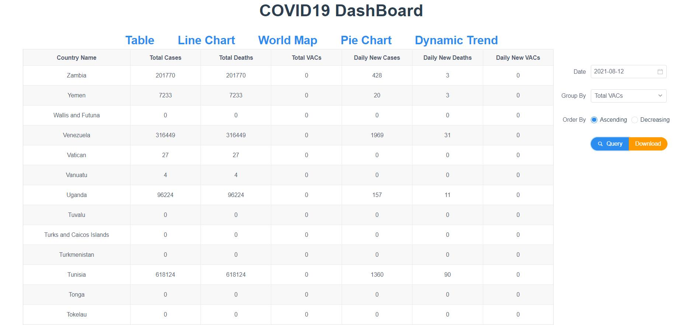
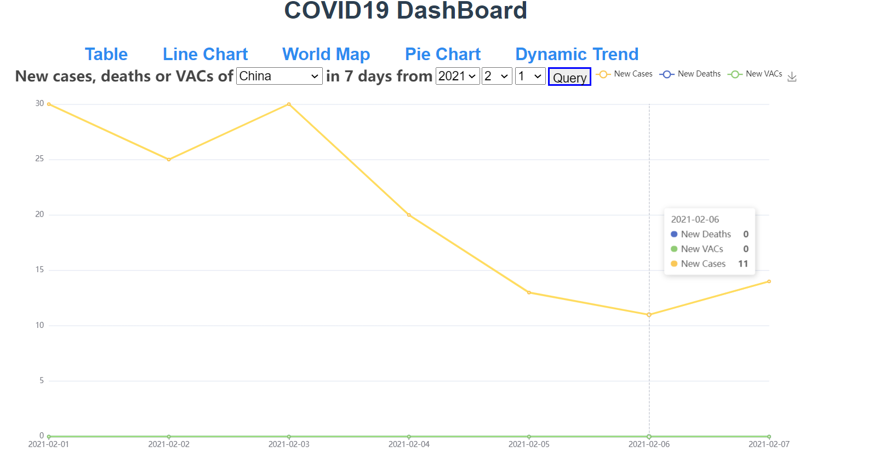
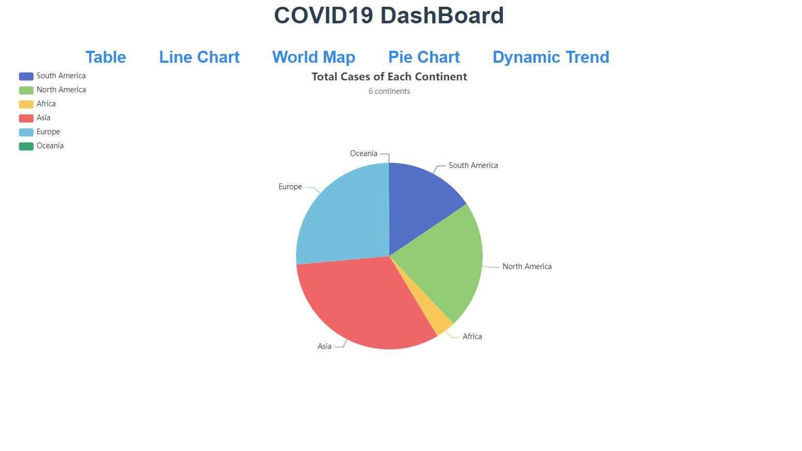
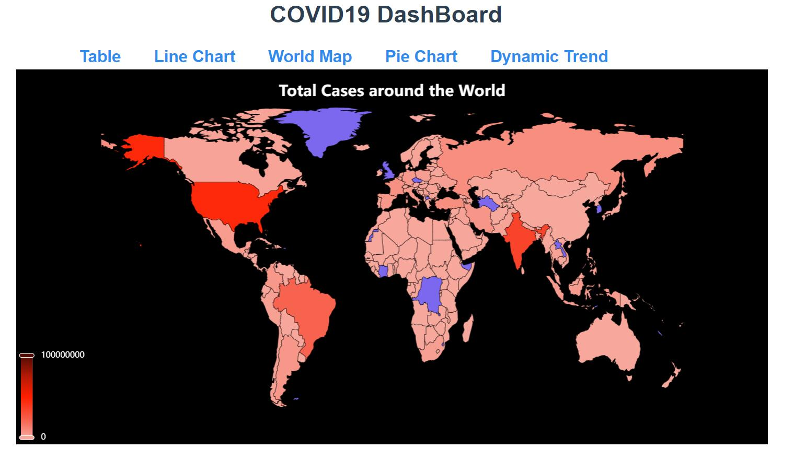
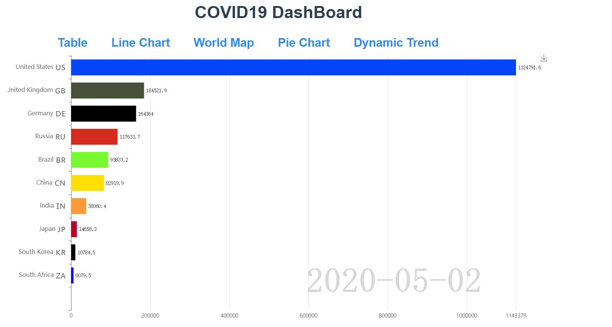
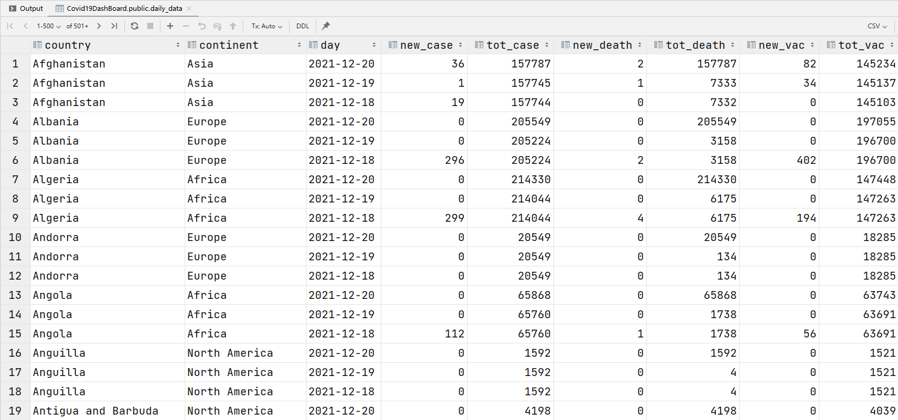

# COVID19_DashBoard_System
This is a project for CS209 at SUSTECH.\
**Team member**: Yifan Zhang, Biao Wang, Sixu Tan

## Ⅰ. Brief introduction
In this project, we built a simple but useful covid19 data visulization web-app, which contains both frontend and backend. Components and techniques utilized are as follows:
* Frontend: Vue, webpack
* Backend: Springboot
* Database: PostgreSQL
* Data source: https://www.worldometers.info/coronavirus/ (Daily update), owid-covid-data.csv(Historcal data)
* Data process: Java

This *DashBoard* contains the following attributes for each country on each day:
* Total infected cases
* New infected cases
* Total deaths
* New deaths
* Total vaccinated
* New vaccinated

This *DashBoard* currently has the following functions:
1. Efficient **data strcture** to process the data and reliable **data storage**.
2. Data **table-view** display.
3. Support **4 methods of visulization**, including **world map**, line charts, dynamic charts, pie charts. With the well-designed backend and frontend, the visulization methods is scalable, which means user can cumstomize the charts with ease.
4. Automatically track the latest covid19 data using **web crawler**.
5. Support **search** and **sort** functions to display table-view.
6. Support **data export** to json and **image export**.
7. **Flexible parameters** can be set to display the data.
8. Support **animation** visulization.

## Ⅱ. Examples
### Table-view with search and sort function

As shown, search and sort can be invoked using the floating selector on the right side.

### Line-chart

Line charts shows the new cases, deaths or VAcs of a selected Country in the last 7 days from ceitain day.

### Pie-chart

Pie charts presents the COVID19 situation among all continents.

### World Map

Map shows total cases of a certain country all around the world.

### Trend Animation

This dynamic animation figure shows the total cases of 10 countries.

### Realtime database

With web crawler, the most up-to-date data can be retrieved. This figure presents part of data scraped from the internet.

## Ⅳ Acknowledgement
Thanks all the team members, they stayed up late for a whole weekend to finish this fancy project.
Thanks Meeting room 804B in College of Engineering, where we combated the codes.
