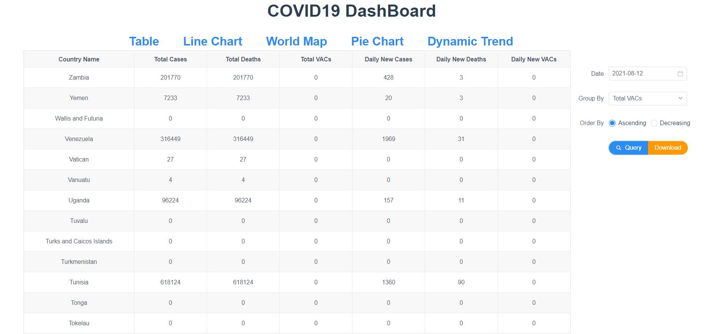

# CS209 Project Report
## COVID19_DashBoard

##### 11911109 张倚凡, 11910216 王标, 11911627 谈思序
----
### Ⅰ. Brief introduction
In this project, we built a simple but useful covid19 data visulization web-app, which contains both frontend and backend. Components and techniques utilized are as follows:
* Frontend: Vue, webpack
* Backend: Springboot
* Database: PostgreSQL
* Data source: https://www.worldometers.info/coronavirus/ (Daily update), owid-covid-data.csv(Historcal data)
* Data process: Java

This *DashBoard* contains the following attributes for each country on each day:
* Total infected cases
* New infected cases
* Total deaths
* New deaths
* Total vaccinated
* New vaccinated

This *DashBoard* currently has the following functions:
1. Efficient **data strcture** to process the data and reliable **data storage**.
2. Data **table-view** display.
3. Support **4 methods of visulization**, including **world map**, line charts, dynamic charts, pie charts. With the well-designed backend and frontend, the visulization methods is scalable, which means user can cumstomize the charts with ease.
4. Automatically track the latest covid19 data using **web crawler**.
5. Support **search** and **sort** functions to display table-view.
6. Support **data export** to json and **image export**.
7. **Flexible parameters** can be set to display the data.
8. Support **animation** visulization.


#### File structure
Main file structure is shown as follows.
```bash
├─COVID19
│  ├─src
│  │  │  App.vue
│  │  │  index.ts
│  │  │  main.js
│  │  │  
│  │  ├─assets
│  │  │      custom.geo.json
│  │  │      data.json
│  │  │      jquery-migrate-3.3.2.js
│  │  │      life-expectation-table.json
│  │  │      logo.png
│  │  │      medium.geo.json
│  │  │      world.json
│  │  │      world_en.json
│  │  │      
│  │  ├─components
│  │  │      DynamicTrend.vue
│  │  │      FileSaver.js
│  │  │      LineChart.vue
│  │  │      PieChart.vue
│  │  │      Table.vue
│  │  │      WeeklyTrend.vue
│  │  │      world.json
│  │  │      WorldMap.vue
│  │  │      
│  │  └─router
│  │          index.js 
└─Springproject   
    ├─src
    │  ├─main
    │  │  ├─java
    │  │  │  │  owid-covid-data.csv
    │  │  │  │  
    │  │  │  ├─com
    │  │  │  │  └─example
    │  │  │  │      └─demo
    │  │  │  │          │  SpringprojectApplication.java
    │  │  │  │          │  
    │  │  │  │          ├─config
    │  │  │  │          │      CorsConfig.java
    │  │  │  │          │      
    │  │  │  │          ├─controller
    │  │  │  │          ├─entity
    │  │  │  │          └─web
    │  │  │  │                  dataProess.java
    │  │  │  │                  HelloTest.java
    │  │  │  │                  
    │  │  │  ├─config
    │  │  │  │      Config.java
    │  │  │  │      
    │  │  │  ├─data
    │  │  │  │      Continent.java
    │  │  │  │      Country.java
    │  │  │  │      CountryCase.java
    │  │  │  │      CountryData.java
    │  │  │  │      DataReadEncapsulation.java
    │  │  │  │      DataToJson.java
    │  │  │  │      DataUtil.java
    │  │  │  │      DynamicData.java
    │  │  │  │      InfoPiece.java
    │  │  │  │      
    │  │  │  └─database
    │  │  │          Crawler.java
    │  │  │          DatabaseAccess.java
    │  │  │          SQLDataSource.java
    │  │  │          
    │  │  └─resources
    │  │      │  application.properties
    │  │      │  config.properties
    │  │      │  
    │  │      ├─static
    │  │      └─templates
    │  └─test
    │      └─java
    │          └─com
    │              └─example
    │                  └─demo
    │                          SpringprojectApplicationTests.java
```

### Ⅱ Class Methods and Fields

#### Data structure

- **continent**

  ```java
   String name;	
   long value;
  ```

  pie charts need continent dataType to express the total cases of every continent.

- Country

  ```java
  private String CountryCode;
  private String CountryName;
  private String Continent;
  public ArrayList<InfoPiece> infoList;
  private int total_cases;
  private int total_deaths;
  private int total_Vacs;
  ```

  Country dataTpye is to store all **infoPieces** of  this country and relevant information. 

- countryCase

  ```java
  String name;
  Long value;
  String Continent;
  ```

  Map chart needs countryCase dataType to represent the total cases of every country.

- countryData

  ```java
  ArrayList<String> date;
  ArrayList<Long>  newDeaths;
  ArrayList<Long>  newVACs;
  ArrayList<Long>  newCases;
  ```

  Line chart needs countryData dataTpye to express from the data on, in the next six day, what newDeaths, newVACs, newCases are.

- dynamicData

  ```java
  String date;
  String  country;
  long cases;
  ```

  dynamic chart needs dynamicData to express  the total cases of the country in this date.

- InfoPiece

  ```java
  public  String CountryCode;
  public  String CountryName;
  public  String Continent;
  public  Date date;
  public  Long newCases;
  public  Long totCases;
  public  Long newDeaths;
  public  Long totDeaths;
  public  Long newVACs;
  public  Long totVACs;
  ```

  InfoPiece dataTpye is to represent every line of the crawler data.

  

#### Data process

The whole process is as follows.

- accept request from the webpage

  **dataProcess**

  ```java
      @GetMapping("/continent")
      public String continent(){}
  
      @GetMapping("/country")
      public String country(@RequestParam String countryName,String date) throws ParseException {}
     
      @GetMapping("/map")
      public String map(){}
  
      @GetMapping("/dynamic")
      public String dynamic(){}
  
      @GetMapping("/table")
      public String table(@RequestParam String date, String group, String order) throws ParseException, NoSuchFieldException {}
  
  ```

- select the corresponding data according to the passed parameters.

  **DataUtil**

  ```java
   public static String mapChartData(ArrayList<InfoPiece> records){}
   
   public static String animaData(ArrayList<InfoPiece> records){}
   
   public static String pieChartData(ArrayList<InfoPiece> records){}
   
   public static String tableData(ArrayList<InfoPiece> records, String group, String order, Date date) throws NoSuchFieldException {}
   
   public static String tableData(ArrayList<InfoPiece> records, String group, String order, Date date) throws NoSuchFieldException {
  ```

- encapsulate the data and return it to the request as Json

  **DataToJson**

  ```java
   public static String tableData(ArrayList<InfoPiece> records, String group, String order, Date date) throws NoSuchFieldException {}
   
   public static String countryDataGet(Country country, Date date) throws ParseException {}
   
   public static String dynamicDataGet(ArrayList<InfoPiece> records) {}
   
   public static String mapDataGet(CountryCase[] country_cases) {}
   
   public static String tableDataGet(ArrayList<InfoPiece> records) {}
  ```


#### Database
**DatabaseAccess**
This methods are used to insert data into database and retrieve data, as their name indicate.
```Java
public static void insertPiece(InfoPiece piece){}
public static ArrayList<InfoPiece> getRecords(PreparedStatement pstm){}
public static ArrayList<InfoPiece> getAllRecords(){}
```


### Ⅲ. Demonstration
#### Table-view with search and sort function

As shown, search and sort can be invoked using the floating selector on the right side.

#### Line-chart

Line charts shows the new cases, deaths or VAcs of a selected Country in the last 7 days from ceitain day.

#### Pie-chart

Pie charts presents the COVID19 situation among all continents.

#### World Map

Map shows total cases of a certain country all around the world.

#### Trend Animation

This dynamic animation figure shows the total cases of 10 countries.

#### Realtime database

With web crawler, the most up-to-date data can be retrieved. This figure presents part of data scraped from the internet.


### Ⅳ Acknowledgement
Thanks all the team members, they stayed up late for a whole weekend to finish this fancy project.
Thanks Meeting room 804B in College of Engineering, where we combated the codes.

   